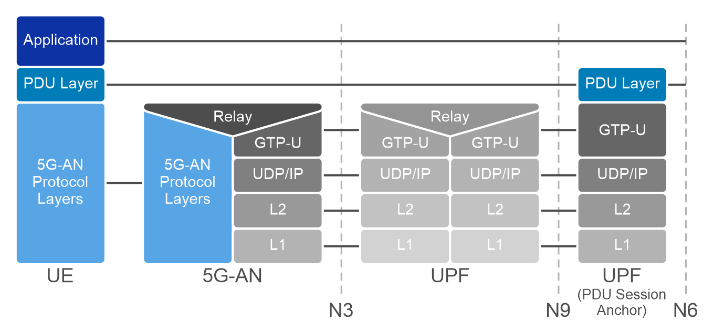

# Introduction to 5G core network

The 5G Core (5GC) is the central component of the 5G network architecture, responsible for managing both control and user plane functions. Acting as the “brain” of the 5G system, it orchestrates the protocols, network interfaces, and services that enable seamless communication across diverse use cases and devices.

The 5G core was designed with a service-based architecture (SBA). This design divides network functions by specific services, allowing for greater flexibility and scalability. As defined by 3GPP standards, the 5G Core is a decomposed architecture where each Network Function (NF) can register for and subscribe to services provided by other NFs using HTTP/2 as the primary communication protocol. This modular and service-oriented approach allows for dynamic service discovery and communication between different core network elements.

Another key feature of the 5G Core is the separation of the Control Plane (CP) from the User Plane (UP), a concept known as Control and User Plane Separation (CUPS). Originally introduced in 3GPP Release 14, CUPS allows for independent scaling of control and user plane functions. For example, during a traffic surge, control plane functions can scale up dynamically without disrupting user plane operations. Additionally, user plane functions (UPF) can be deployed closer to the Radio Access Network (RAN) and User Equipment (UE) to optimize performance for latency-sensitive applications,

Key components of the 5G core include:

- **Access and Mobility Management Function (AMF):** 
  - Responsible for UE registration, mobility management, and connection setup. The AMF also handles signaling between the UE and the 5G core. Key interfaces are N1 (UE ⇔ AMF): Used for Non-Access Stratum (NAS) signaling between the UE and the AMF, and N2 (AMF ⇔ RAN): Interface between the AMF and the Radio Access Network (gNodeB) for control signaling, uses IP/SCTP/NGAP. It identifies a network slice using the Single Network Slice Selection Assistance Information (S- NSSAI), which includes the Slice/Service Type (SST) and Slice Differentiator (SD). 
  - 
- **Session Management Function (SMF):** 
  - Manages session establishment, modification, and release, including IP address allocation and policy control for traffic routing. Key interfaces includes N4 (SMF ⇔ UPF): Interface between the SMF and the User Plane Function (UPF) to control the user plane data path. Uses PFCP. The Session Management Function (SMF) is crucial element that make up the 5G Core Network responsible for establishing, maintaining, and terminating network sessions for User Equipment (UE). The SMF carries out these tasks using network protocols such as Packet Forwarding Control Protocol (PFCP) and Network Function-specific Service-based interface (Nsmf).
  
- **User Plane Function (UPF):**
  - The User Plane Function (UPF) is a critical component of the 5G Core responsible for routing and forwarding user data packets. It serves as a bridge between the 5G network and external data networks, such as the internet or private networks. Key interfaces for the UPF include N3, which connects the UPF to the gNodeB for user plane data using the GTP-U (GPRS Tunneling Protocol - User Plane). The N6 interface links the UPF to external data networks, allowing for seamless data transmission. Additionally, the N4 interface facilitates control signaling from the Session Management Function (SMF) to the UPF for managing the user plane, utilizing the PFCP (Packet Forwarding Control Protocol).

    In the context of 5G, a PDU (Protocol Data Unit) session is established to support the transmission of user data, linking the UPF to the corresponding data flows and network slices. Each PDU session is associated with a specific network slice, enabling tailored services and quality of service (QoS) based on the slice’s requirements. In our workshop, we will be utilizing a monolithic UPF, which simplifies the deployment by integrating all user plane functionalities into a single entity. As a result, the N9 interface, which typically facilitates inter-UPF communication for traffic routing and load balancing, will not be used in this scenario.

  
- **Unified Data Management (UDM):**
  - Acts as the central repository for subscriber data, handling functions like user authentication, authorization, and subscription profiles.
  
- **Network Slice Selection Function (NSSF):**
  - Enables the dynamic selection of network slices for different services, ensuring that specific traffic is routed through the appropriate slice.
  
- **Service Communication Proxy (SCP):**
  - Facilitates communication between different 5G core functions. The SCP acts as an intermediary, optimizing routing and enhancing security for service-based interactions between 5G core components.

- **Network Repository Function (NRF):**
  - Provides a directory of available network functions and their capabilities. The NRF allows the core network functions to discover and communicate with one another, promoting flexibility and dynamic configuration of network services.

The NSSF, SCP and NRP communicate using HTTP/2 (service-based architecture)