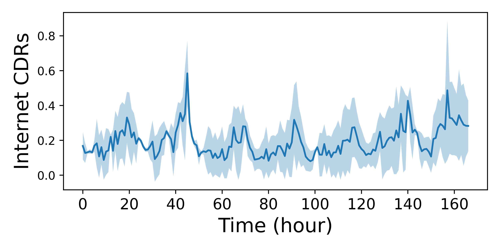

# Introduction to Network Modeling and Dynamic Resource Scaling

## Motivation
The quality of service (QoS) experienced by the users of a slice depends on the slice traffic and the allocated resources (CPU, memory, bandwidth, etc.). As shown in the figure below, the traffic experienced by the users of a slice is dynamic and fluctuates over time. To ensure a high QoS, an infrastructure provider (InP) can allocate dedicated resources to each slice based on its peak traffic. However, this approach often leads to over-provisioning as the actual slice traffic rarely reach its peak, resulting in the under-utilization of resources. On the other hand, allocating resources based on average traffic can lead to under-provisioning when the actual traffic is higher than the average, resulting in poor QoS and potential SLA violations. Therefore, the InP needs to dynamically adjust the allocated resources to match the actual traffic and SLA requirements. This is referred to as **dynamic resource scaling**.

  

For dynamic resource scaling, it is crucial to accurately model the relationship between resource allocation and the QoS metrics. This is referred to as **network modeling**. However, QoS metrics for an end-to-end slice, such as throughput, latency, and reliability, rely on various resource types across multiple network segments, including the Radio Access Network (RAN), transport network, and core network. Traditional network models often fail to capture these complexities accurately, where as network simulators are complex and too slow to be used for real-time resource management.

Therefore, for dynamic resource scaling for network slices, we have developed two frameworks:
1. **vNetRunner**: A slice modeling framework that uses ML to accurately model individual 5G VNFs, and then composes them to form end-to-end 5G network slice models.
2. **MicroOpt**: A framework that incorporates the slice model and leverages primal-dual optimizaiton to optimize the resource allocation for a given slice model and traffic profile, in real-time.

## vNetRunner overview

Machine learning-based network models can be categorized based on their modularity—specifically, device-level versus network-level—and their granularity—packet-level versus flow-level.

**Device-level vs Network-level:**  Device-level modeling approaches focus on modeling each VNF individually, subsequently integrating these models to simulate the entire network. Conversely, network-level modeling approaches employ sophisticated neural network architectures, such as Graph Neural Networks (GNNs), to model the network as a whole. Despite their sophistication, these network-level models often struggle to generalize when the network topology changes. Furthermore, they demand extensive datasets for training due to the vast input space.

**Flow-level vs Packet-level:** Network modeling approaches can also be categorized based on their prediction granularity. Flow-level modeling techniques focus on predicting flow-level metrics such as mean throughput or delay, but they lack the capability to provide insights into packet-level metrics, such as per-packet delay and packet drop. Despite this limitation, flow-level metrics are generally sufficient for dynamic resource scaling. In contrast, packet-level modeling approaches are capable of predicting detailed packet-level metrics, including per-packet delay. However, this increased granularity comes at the cost of higher computational complexity, resulting in inference times that can range from several seconds to several minutes. This may be too high for algorithms that require thousands of interactions with the network model.

  

**vNetRunner:** Our network modeling framework, named vNetRunner, falls in the device-level and flow-level category, which has not been explored before, and is the ideal option in the context of dynamic resource scaling for 5G network slices due to its high accuracy and low computation complexity.

## MicroOpt Overview

  

[MicroOpt](https://arxiv.org/abs/2407.18342) is a resource optimization framework that leverages the slice model provided by vNetRunner for precise QoS predictions. As shown in the figure, MicroOpt combines vNetRunner’s output with a primal-dual algorithm to efficiently allocate resources for network slices in a 5G network.

The process begins with vNetRunner, which generates QoS predictions based on the current resource allocation. These predictions feed into the primal-dual optimization algorithm, which is responsible for balancing resource minimization and QoS requirements. The optimization involves two main steps:

- **Gradient Descent:** Adjusts resource allocation to minimize the overall resource usage while maintaining QoS thresholds.
- **Lagrange Multiplier Update:** Ensures that QoS constraints are met by adjusting QoS violation penalties in each iteration.

This iterative process continues until an optimal resource allocation is achieved, balancing resource minimization and QoS requirements across network slices.

For an indepth explanation of the MicroOpt framework, please refer to our [paper](https://arxiv.org/abs/2407.18342).