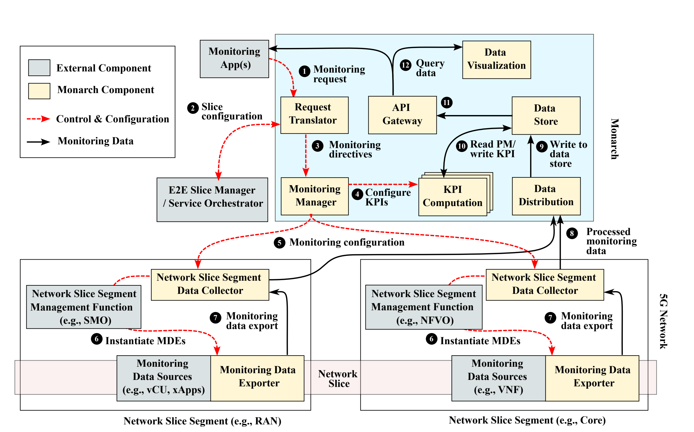

## **Monitoring Network Slices**  
**Time:** November 19th, 1:30 PM - 4:00 PM  

Welcome to the second session of the Rogers Executive Workshop!
In this session, we will look at monitoring network slices with **5G-Monarch**.

The figure above shows the conceptual architecture of Monarch. Monarch is designed for cloud-native 5G deployments and focuses on network slice monitoring and per-slice KPI computation.

### **1. Setting Up Monitoring Tools**

In this session, we will use [5g-monarch](https://github.com/niloysh/5g-monarch) to monitor 5G network slices and collect real-time telemetry data.

**Install Monarch Components**
- Install various Monarch components such as Prometheus for collecting and storing metrics data and Grafana for visualizing and analyzing slice performance metrics.
- Configure Monarch for slice-level data collection e.g., slice throughput.

By the end of this setup, participants will have real-time monitoring for deployed slices.

### **2. Hands-on Monitoring and Telemetry Collection**

We will monitor slices using the configured tools, observe performance metrics, and gain insights into slice health:

1. **Set Up Dashboards in Grafana**: Create custom dashboards for visualizing slice-specific metrics.
2. **Real-Time Monitoring Exercises**:
    - Track number of subscribers, CPU usage for NFs.

For exercises, see the [labs](https://github.com/niloysh/5g-monarch/labs/lab1.md).
