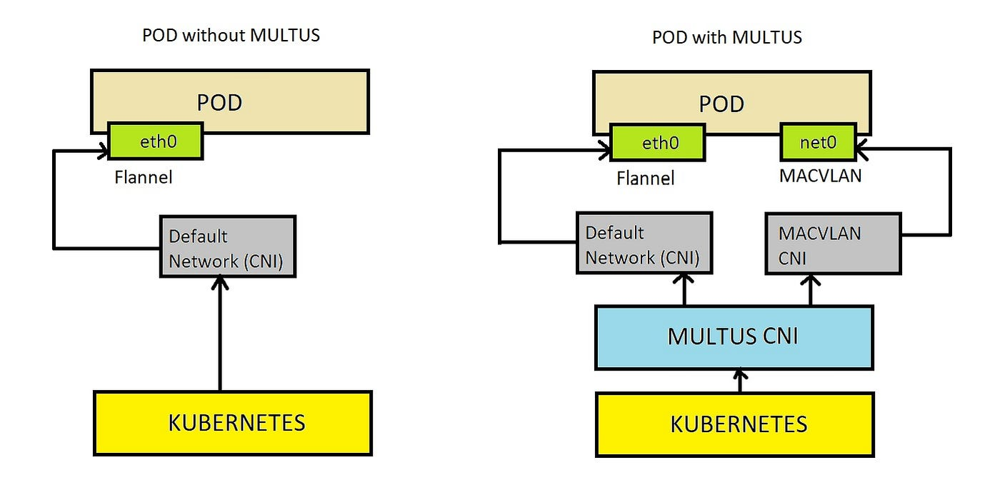

# Key Tools and Technologies

In order to build, manage, and simulate a 5G core network, several tools and technologies are used:

### 1. **Kubernetes**
   - Kubernetes is an open-source platform used for automating the deployment, scaling, and management of containerized applications.
   - In 5G networks, it can be used to manage the deployment of the core network functions as microservices, enabling scalability and reliability.
   - Key features include container orchestration, service discovery, load balancing, and automated rollouts/rollbacks.

### 2. **Open vSwitch (OVS)**
   - OVS is a virtual switch designed to be used in virtualized environments. It allows for network traffic control within virtualized infrastructures.
   - In the context of 5G, OVS is often used to handle packet forwarding within the network and to manage traffic between different network functions.
   - It supports features like VLAN tagging, tunneling (VXLAN, GRE), and integration with SDN controllers.

### 3. **Multus CNI**
   - Multus is a Kubernetes CNI (Container Network Interface) plugin that allows the use of multiple network interfaces for pods.
   - In 5G networks, Multus enables network functions to communicate over multiple network interfaces (e.g., one interface for control plane traffic and another for data plane traffic), supporting diverse 5G use cases.

  

### 4. **Open5GS**
   - Open5GS is an open-source project that implements the 5G core network and Evolved Packet Core (EPC) functionalities.
   - It includes key network functions like AMF, SMF, UPF, and others that are essential for managing mobile networks.
   - Open5GS can be used for learning, development, and small-scale testing of 5G networks.

### 5. **UERANSIM**
   - UERANSIM (User Equipment and Radio Access Network Simulator) is an open-source project that simulates 5G UE and gNodeB (the 5G base station).
   - It allows for the simulation of 5G access network elements and enables testing of 5G core networks in a controlled, virtualized environment.
   - UERANSIM will be paired with Open5GS to simulate end-to-end 5G communication.